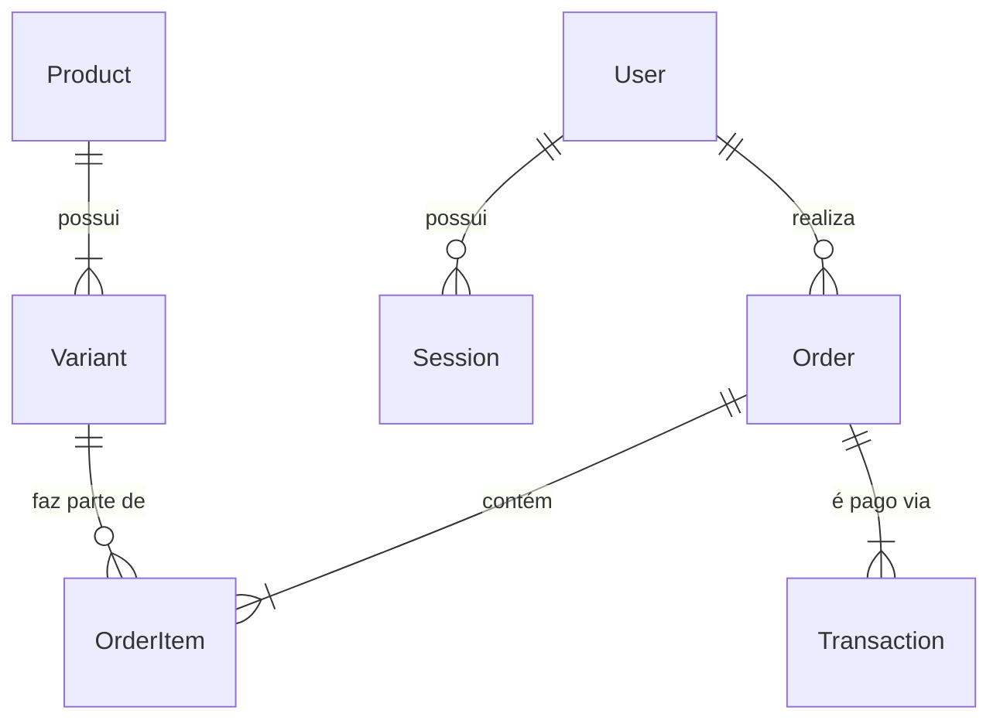

# 🗄️ Modelagem de Dados e Engenharia de Banco (Prisma ORM)

Este artefato detém a estrutura neural dos dados financeiros e de domínio da FlowFit.

## 1. O Paradigma do Banco de Dados
A FlowFit exige Integridade Referencial estrita para dinheiro (Checkout) e velocidade (Leituras de Catálogo).
- **SGBD Escolhido:** PostgreSQL (Nuvem gerenciada via AWS RDS / Supabase).
- **Acesso a Dados:** Prisma ORM. Utilizado pela sua segurança intrínseca contra SQL Injection e geração de tipagem robusta (Typesafe) para o TypeScript.

## 2. Diagrama de Relacionamento (DER Lógico)
*(Modelo Simplificado dos Domínios Centrais)*



## 3. Diretrizes de Modelagem Enterprise
1. **Soft Deletes vs Hard Deletes:**
   Não apagamos dados financeiros ou pedidos. Para Clientes que invocam a exclusão de conta via LGPD, nós **Anonimizamos** os dados pessoais (`name`, `email`), mas preservamos a rastreabilidade do ID do pedido por 5 anos (Conformidade Fiscal/Receita Federal).
2. **Índices de Alta Frequência (B-Tree):**
   Todos os campos que sofrem chamadas em `WHERE` ou `JOIN` de alta escala são indexados. Exemplo: `@@index([userId])`, `@@index([gatewayId])`.
3. **Escala Decimal em Transações:**
   Valores em Reais (R$) não utilizam tipo `Float` devido a imprecisões de ponto flutuante no Javascript. O Prisma é forçado a usar `Decimal` mapeado diretamente para numéricos do PostgreSQL (`@db.Decimal(10, 2)`).

## 4. Policiamento de Concorrência
Problemas como *Duplo-Gasto* (Cliente com 2 abas enviando pagamento duas vezes) são neutralizados via Travas de Transação (Transaction Locks).
```typescript
// Exemplo de Lock Ativo em Prisma
await prisma.$transaction(async (tx) => {
   // Isolamento Nível: Serializable/Repeatable Read
   const user = await tx.user.findUnique({ where: { id } });
   // Atualiza carteira bloqueando concorrência
});
```
